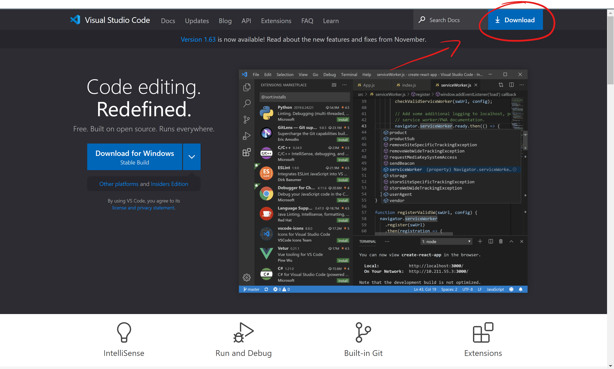
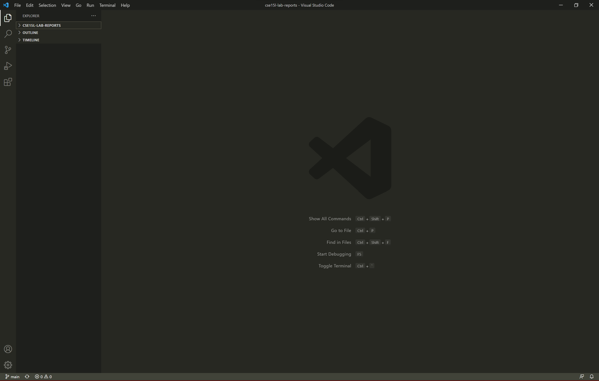
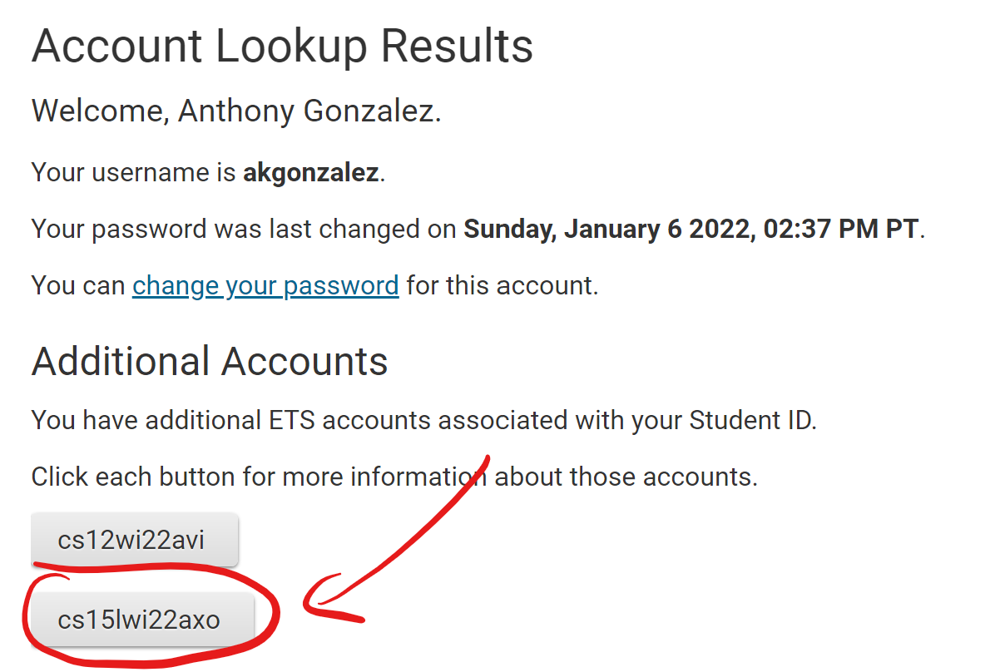
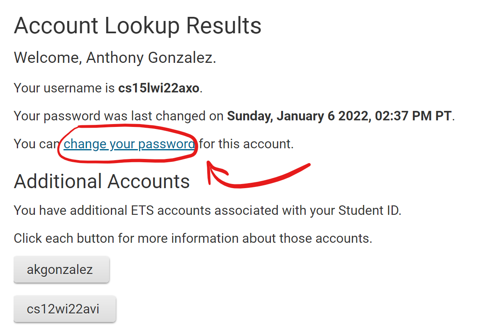
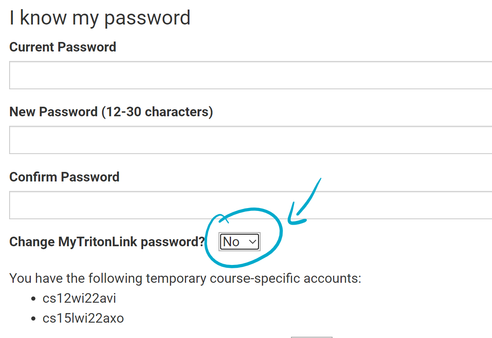
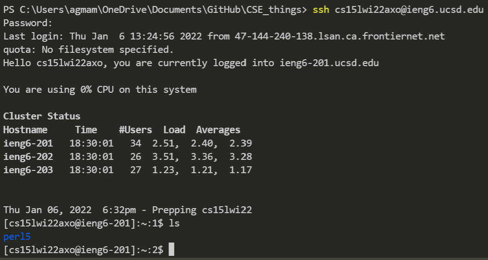

# How to get set up for CSE15L
## 1) Download Visual Studio Code (VSCode)
The first thing that you want to do is to download an IDE (integrated development environment) which will help you run and edit code for this class.
  
By going to this link [VSCode download](https://code.visualstudio.com/) you can go to the Visual Studio code website, and in the top right corner you can click download as seen in the image below.
 

 
 
After clicking the download button in the corner, it will redirect you to a different page showing the different downloads for given operating systems.
  
Select the correct download given your operating system from the given options.
  

  
Then you will be able to open your visual studio code and have a similar application as the image below.
  

 
## 2) Remotely Connecting with SSH
The first thing that you will have to do if you are on the windows operating system is to [follow these steps to install OpenSSH](https://docs.microsoft.com/en-us/windows-server/administration/openssh/openssh_install_firstuse)
 
 
After doing this you will have to find your login information for the `ieng6  ` servers by inputing your PID and ucsd username in the [ETS System here](https://sdacs.ucsd.edu/~icc/index.php)
  
Here you will find your login credentials to login to the server seen in the example image below. And you will want to click on your credentials.
  

  
After clicking your login username, it will take you to a new page where you will see the page below. The next step is to click on the "change your password" link to reset your password (a necessary step to login to the server).
  

 
 
Next you will change your password and determine whether you would like to change your tritonlink password too, if you do not, change this checkbox to no.
 
 

  
After changing your password, open VSCode and open a new terminal by clicking on the terminal tab in the top right corner and opening a new tab.
  
In the new terminal enter the command except replace the zz's with your own login code above.
 
`$ ssh cs15lwi22zz@ieng6.ucsd.edu`
 
After entering this command you will be prompted in the terminal to which you should enter `yes` to continue.
 
Once entering `yes` a `Password: `promt will come up, to which you type in your newly changed password.
 
**Even though your inputs are not echoed back, your password IS getting inputted**
  
The terminal should look like this once you have completed the steps
  

  
**You are now connected to the ieng6 server!!**
 
## 3) Trying Some Commands

 
Moving Files with scp
 
Setting an SSH Key
 
Optimizing Remote Running