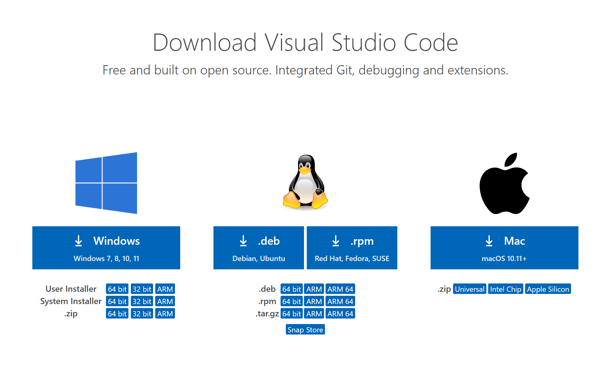

# How to get set up for CSE15L
## 1) Download Visual Studio Code (VSCode)
The first thing that you want to do is to download an IDE (integrated development environment) which will help you run and edit code for this class.
 
By going to this link [VSCode download](https://code.visualstudio.com/) you can go to the Visual Studio code website, and in the top right corner you can click download as seen in the image below.
 

 
 
After clicking the download button in the corner, it will redirect you to a different page showing the different downloads for given operating systems.
 
Select the correct download given your operating system from the given options
 

 
Then you will be able to open your visual studio code and have a similar application as the image below.
 

 
---
## 2) Remotely Connecting with SSH
 
Trying Some Commands
 
Moving Files with scp
 
Setting an SSH Key
 
Optimizing Remote Running