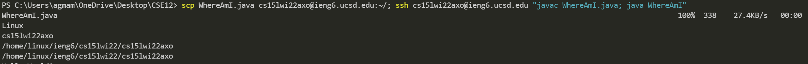

# How to get set up for CSE15L
## 1) Download Visual Studio Code (VSCode)
The first thing that you want to do is to download an IDE (integrated development environment) which will help you run and edit code for this class.
<br><br>
By going to this link [VSCode download](https://code.visualstudio.com/) you can go to the Visual Studio code website, and in the top right corner you can click download as seen in the image below.
<br>

<br>
<br>
After clicking the download button in the corner, it will redirect you to a different page showing the different downloads for given operating systems.
<br><br>
Select the correct download given your operating system from the given options.
<br><br>

<br><br>
Then you will be able to open your visual studio code and have a similar application as the image below.
<br><br>

<br>
## 2) Remotely Connecting with SSH
The first thing that you will have to do if you are on the windows operating system is to [follow these steps to install OpenSSH](https://docs.microsoft.com/en-us/windows-server/administration/openssh/openssh_install_firstuse)
<br>
<br>
After doing this you will have to find your login information for the `ieng6  ` servers by inputing your PID and ucsd username in the [ETS System here](https://sdacs.ucsd.edu/~icc/index.php)
<br><br>
Here you will find your login credentials to login to the server seen in the example image below. And you will want to click on your credentials.
<br><br>

<br><br>
After clicking your login username, it will take you to a new page where you will see the page below. The next step is to click on the "change your password" link to reset your password (a necessary step to login to the server).
<br><br>

<br>
<br>
Next you will change your password and determine whether you would like to change your tritonlink password too, if you do not, change this checkbox to no.
<br>
<br>

<br><br>
After changing your password, open VSCode and open a new terminal by clicking on the terminal tab in the top right corner and opening a new tab.
<br><br>
In the new terminal enter the command except replace the zz's with your own login code above.
<br>
`$ ssh cs15lwi22zz@ieng6.ucsd.edu`
<br>
After entering this command you will be prompted in the terminal to which you should enter `yes` to continue.
<br>
Once entering `yes` a `Password: `promt will come up, to which you type in your newly changed password.
<br>
**Even though your inputs are not echoed back, your password IS getting inputted**
<br><br>
The terminal should look like this once you have completed the steps
<br><br>

<br><br>
**You are now connected to the ieng6 server!!**
<br>
## 3) Trying Some Commands
Now that you are in the server, time to test out some commands! You can try these commands, and compare them to the results below
<br>
```
ls
ls -a
ls -la
```
<br>

<br>
If you want to try more commands, search "Linux Terminal Commands" for more commands to try. Enter `exit` or CTRL-D to leave the SSH
<br>

## 4) Moving Files with `scp`
Now we are going to practice moving files from your local hardware to the ieng6 server. To begin we will create a new file on our local system. In VSCode create a new file named `WhereAmI.java` and enter the following code.
```
class WhereAmI {
  public static void main(String[] args) {
    System.out.println(System.getProperty("os.name"));
    System.out.println(System.getProperty("user.name"));
    System.out.println(System.getProperty("user.home"));
    System.out.println(System.getProperty("user.dir"));
  }
}
```
Then run `javac WhereAmI.java` followed by `java WhereAmI` to see the results, somwhat similar to this.
```
Windows 10
agamam
C:\Users\agmam
C:\Users\agmam\OneDrive\Documents\GitHub\CSE_things\CSE15
```
Now that `WhereAmI.java` runs, we can enter the code(replace zz's with your code):
```
scp WhereAmI.java cs15lwi22zz@ieng6.ucsd.edu:~/
```
This will copy the `WhereAmI.java` to the server, and you can check by logging in to the ssh and using 'ls' to see it in the directory. And you can compile and run it to see results like the one below.
<br>

<br>
## 5) Setting up an SSH Key
After loggin in mutliples times to the SSH it is starting to get a bit tiring to enter your password everytime, so to help speed up the process we will create a key to let the server know that it is us logging in to our accout.
<br><br>
First you want to exit from the ieng6 server using 'exit' or CTRL-D, and then you want to enter the following command `ssh-keygen` 
<br><br>

<br>
Now you will login to the SSH again and add a file named .ssh using the command `mkdir .ssh` as shown below.
<br>

<br>
Then you exit the SSH and back on your local system enter the following code, except replacing the <> part with your own information
```
scp /Users/<Local Username>/.ssh/id_rsa.pub cs15lwi22<id>@ieng6.ucsd.edu:~/.ssh/authorized_keys
```
And lastly enter your password. After this SSH back into the ieng6 servers and you will see that you no longer have to enter your password.

## 6) Optimizing Remote Running
Lastly to help you remotely run programs on the ieng6 servers here are a few commands that can help you automate the process.
<br><br>
By using semicolons, you can run multiple commands in the same line
```
javac WhereAmI.java; java WhereAmI
```
Also you can log into a server and run commands by putting them in "" (quotes) to run multiple commands
```
scp WhereAmI.java cs15lwi22axo@ieng6.ucsd.edu:~/; ssh cs15lwi22axo@ieng6.ucsd.edu "javac WhereAmI.java; java WhereAmI"
```
This command copies WhereAmI.java to the server, compiles it and runs it all in one command as seen below.
<br>
