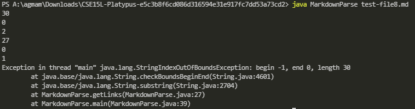

# Lab Report 2
## First Bug
---
 

[First Bug Link](https://github.com/AntDaKnee/markdown-parse/commit/8c7b461d7e700bea431a49186e77524e1cb83fb1)
 
 

 
The first bug that we had was that we encountered occured when we had a .md file with [] in it 
but without having any parenthesis. This caused an error as when we tried to print the 
url, the first index was -1 which lead to an IndexOutOfBoundsException.
In order to fix this we added a check to see if there were any parenthesis in the
file and if there wasn't then we would return an empty array.
 

## Second Bug
---
 

[Second Bug Link](https://github.com/AntDaKnee/CSE15L-Platypus/commit/6c1ec4c6c325477b0354f46a43f3edf2936a147e)
 
 

 
This symptom has a wrong output for the code, the file contains an image, yet the program
returns the image thinking it is a link. The bug was that we did not check if it
was a link or an image, so we added a check to see if there was an "!" before
the brackets and if there was we wouldn't return it as it is an image.

## Third Bug
---
 

[Third Bug Link](https://github.com/nseyoum/CSE15L-Platypus/commit/e5c3b8f6cd086d316594e31e917fc7dd53a73cd2)
 
 

 
This symptom was that we were getting an error for index out of bounds when 
testing test-file8.md. The bug that we had was our implementation of the previous
debug, being that we were checking for an "!", except in this case it was a link
on starting on index 0. As this starts on index 0, it checks for the ! one index
before it which makes it look at index -1 giving the error. We fixed this by 
checking that the initial index of nextOpenBracket was greater than 0.