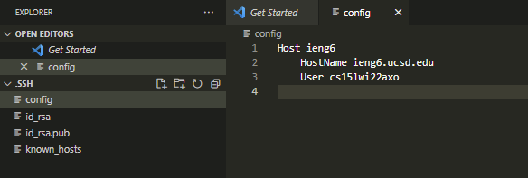
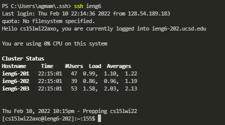
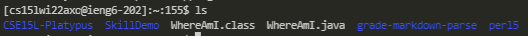
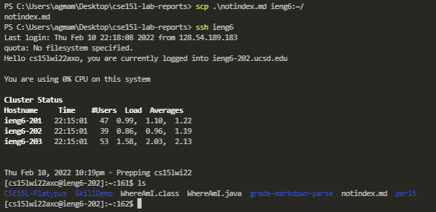

# Lab Report 3
## How to Streamline the SSH Process
---
<br>

First you want to go into your  `~./.ssh/config` file, if you dont have one then
you can first go into your `~./.ssh` folder in VSCode. Once you find the `.ssh`
(It should be in Users, then your username), then you want to open the `.ssh`
folder in your editor. In the `.ssh` folder create a new file titled `config`.
In the file put the following code with your own username. 

```
Host ieng6
    HostName ieng6.ucsd.edu
    User cs15lwi22zzz
   
```


<br><br>

Next you can test out the effects in the terminal by running `ssh ieng6`, this 
will allow you to log in without typing out the long username and host as shown
below.


<br><br>

Lastly you can use this to further optimize your commands, an example of this 
can be seen when using the `scp` command. The screenshots below show how quick
it is to copy items over to the ieng6 servers given this new ssh technique


<br>

Here we see that there is no `notindex.md` file in the ieng6 servers

<br>

<br>

And after running some short commands we can see that we copy over `notindex.md`
over to the ieng6 servers in a relatively short amount of keystrokes.