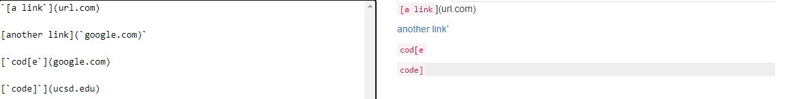
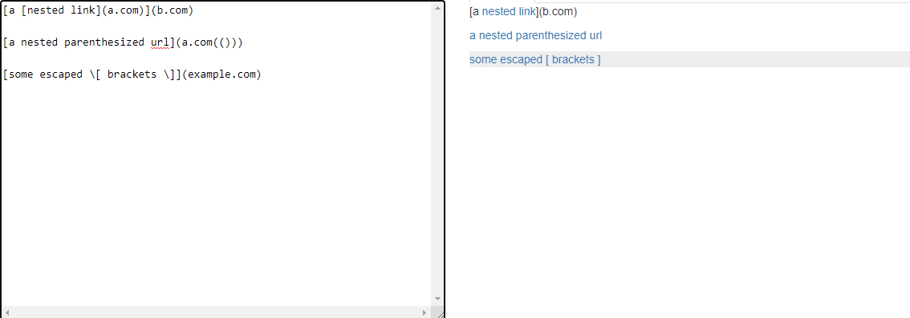
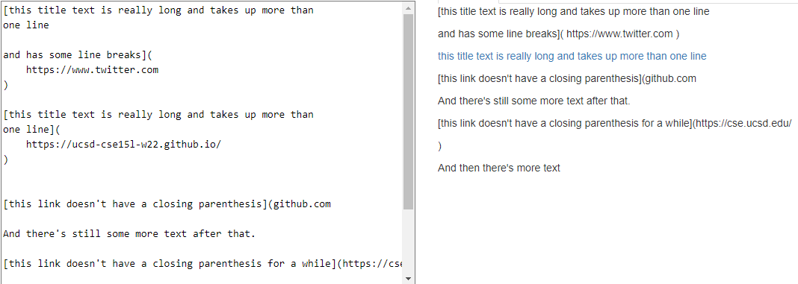
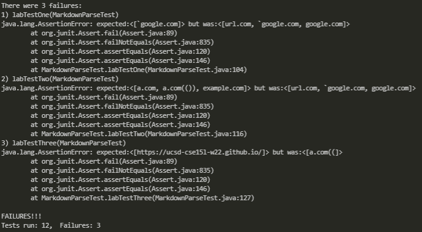
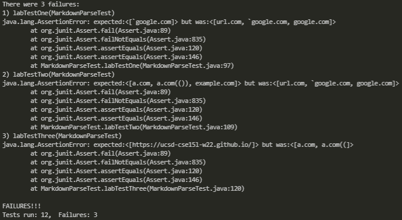

# Lab Report 4
## Github Links:

[My Github Repo](https://github.com/AntDaKnee/CSE15L-Platypus.git)

[Reviewed Github Repo](https://github.com/ezhou413/markdown-parse)

---

# Given Snippets and Their Results

## Snippet 1

<br>

```
`[a link`](url.com)

[another link](`google.com)`

[`cod[e`](google.com)

[`code]`](ucsd.edu)
```



---

## Snippet 2

<br>

```
[a [nested link](a.com)](b.com)

[a nested parenthesized url](a.com(()))

[some escaped \[ brackets \]](example.com)
```



---

## Snippet 3

<br>

```
[this title text is really long and takes up more than 
one line

and has some line breaks](
    https://www.twitter.com
)

[this title text is really long and takes up more than 
one line](
    https://ucsd-cse15l-w22.github.io/
)


[this link doesn't have a closing parenthesis](github.com

And there's still some more text after that.

[this link doesn't have a closing parenthesis for a while](https://cse.ucsd.edu/


)

And then there's more text
```



<br><br>

## Code to Test the Snippets

```
    @Test
    public void labTestOne() throws IOException {
        Path fileName = Path.of("lab-test-file1.md");
        String contents = Files.readString(fileName);
        ArrayList<String> links = MarkdownParse.getLinks(contents);

        List<String> correctOutput = List.of("`google.com");

        assertEquals(correctOutput, links);
    }

    @Test
    public void labTestTwo() throws IOException {
        Path fileName = Path.of("lab-test-file1.md");
        String contents = Files.readString(fileName);
        ArrayList<String> links = MarkdownParse.getLinks(contents);

        List<String> correctOutput = List.of("a.com", "a.com(())",
            "example.com");

        assertEquals(correctOutput, links);
    }

    @Test
    public void labTestThree() throws IOException {
        Path fileName = Path.of("lab-test-file2.md");
        String contents = Files.readString(fileName);
        ArrayList<String> links = MarkdownParse.getLinks(contents);

        List<String> correctOutput = List.of("https://ucsd-cse15l-w22.github.io/");

        assertEquals(correctOutput, links);
    }
```

<br><br>

---
# Testing the Given Snippets

## Running the Test on My Own Implementation of MarkdownParse

Here is the result output of running the JUnit tests on my program. My program
ended up failing all the given snippets.




---

<br>

## Running the Test on the Reviewed MarkdownParse

Here is the result output of running the JUnit tests on the reviewed program.
This program failed all the added tests as well.



<br>

---

# Ending Questions

## Question 1: 
Do you think there is a small (<10 lines) code change that will make your 
program work for snippet 1 and all related cases that use inline code with
 backticks? If yes, describe the code change. If not, describe why it 
 would be a more involved change.

Answer: I do not believe that there is a small implementation that will be able
to fix the given test case. The reason for this is the second link being an
actual link. This means that we would need to not only check for two backticks
but also check if the backticks are in the parenthesis. On top of this we will
have to see if the backticks are on a new line or if there is no ending
backtick at all. This would cause too much difficulty to implement in 10 lines
or less of code.

## Question 2: 
Do you think there is a small (<10 lines) code change that will make your 
program work for snippet 2 and all related cases that nest 
parentheses, brackets, and escaped brackets? If yes, describe the code change. 
If not, describe why it would be a more involved change.

Answer: I do not think there is a small fix to the code for the given snippet,
as there are too many cases to check for when trying to implement a fix for
these test. We would need to add a way to test for a nested link, and to only
return the nested link, whilst also having a parentheses and bracket counter.
This is all too much to add within the given 10 line limit.

## Question 3:
Do you think there is a small (<10 lines) code change that will make your 
program work for snippet 3 and all related cases that have newlines in brackets 
and parentheses? If yes, describe the code change. If not, describe why 
it would be a more involved change.

Answer: Yes I think that we could implement a check for this given snippet
that could be less than 10 lines. The only main issue is that we need to check
if there is more than 1 new line, if there is then we count it as an invalid
link, so we could simply add a method checking if there are 2 `\n`'s after
we get the open bracket, if there is 2 or more then it is an invalid link and we
find the next bracket, and if there is 1 or less `\n` then we add the link.
All of this code could be implemented in a counter that counts how many
`\n`'s there are which could be added in less than 10 lines of code.