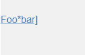
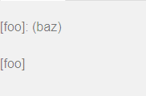
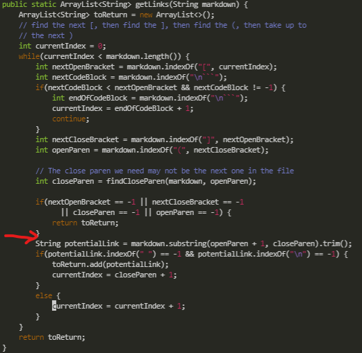

# Lab Report 5
## Test Discrepancies

To get the given tests I used the `diff` command with the files from both
repositories testing all the test files. The .txt file also contained the
file that we tested so that way I could go look at the file afterward.

---
### Difference 1

Line 212, test-files/194.md
<br>
The given file contains the text

```
[Foo*bar\]]:my_(url) 'title (with parens)'

[Foo*bar\]]
```

Our repository returned []
<br>
The given markdownParse repository returned [url]
<br>
Expected output [Foo*bar]]



<br>

Both the programs got this file wrong, by testing it in the 
[CommonMark Demo Site](https://spec.commonmark.org/dingus/) it stated that the
link should be `title (with parens)`. The given bug is that this input is 
a different implementation of links than what we have, being in a different
format than `[link title](url)`. To fix this we would need to add another
check seeing if the link is in the given format, including the :my_(url) to
create the link.

---
### Difference 2


Line 230, test-files/201.md
<br>
The given file conatins the text

```
[foo]: <bar>(baz)

[foo]
```

Our repository returned []
<br>
The given markdownParse repository returned [baz]
<br>
Expected Output []



<br>

The given markdownParse repository got this file wrong, as the expected input
as tested at the [CommonMark Demo Site](https://spec.commonmark.org/dingus/)
did not return any links in this file. The given issue is that the provided
MarkdownParse file does not check to see if there is anything between the
`[]` and the `()` making the link invalid, so the if there is a `[]` and stuff
between the `]` and `(` then it will think its a valid link when it should not
be. The issue need to be fixed could add a test where the arrow is in the
image below.

